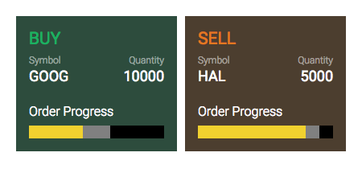

Angular Testing Techniques
==========================

This is a simple example to demonstrate various techniques to test Angular apps, specifically:

1. Visualizing different states of a component using Storybook
2. Unit testing a component
3. Integration testing (a.k.a. end-to-end testing) the entire app

A screen shot of the final app is shown below. It contains a single page with two tiles representing a buy order and a sell order in the stock market. Each tile is created using an Angular component called `OrderViewComponent`.



This project was generated with [Angular CLI](https://github.com/angular/angular-cli) version 6.0.8.

Quick Start
-----------
```bash
$ yarn install  <--- npm install works too
$ ng serve
```

Now point your browser to http://localhost:4200/.


Visual testing
--------------
Allows you to visualize different states of your UI components and develop them interactively.

#### Tools
- [Storybook](https://storybook.js.org/)

#### Tests
- [index.stories.ts](src/stories/index.stories.ts): Instantiates the `OrderViewComponent` in five different states to ensure that it is rendered correctly.

#### Running the tests

    yarn storybook
    
Point your browser to http://localhost:6006/


Unit testing
------------
Tests a single component in isolation.

#### Tools
- [Karma](https://karma-runner.github.io/): Test runner
- [Jasmine](https://jasmine.github.io/): Testing framework
- [Angular testing utilities](https://angular.io/guide/testing#testing-utility-apis): TestBed & Component Fixture

#### Tests
- [order-progress-bar.component.spec.ts](src/app/order-progress-bar/order-progress-bar.component.spec.ts): Instantiates the `OrderProgressBarComponent` in different states and tests if the bars in the progress bar have the expected lengths.

- [order-view.component.spec.ts](src/app/order-view/order-view.component.spec.ts): Instantiates the `OrderViewComponent` with a buy and a sell order and tests if the correct data and colors are rendered.

#### Running the tests

    ng test


Integration (end-to-end) testing
--------------------------------
Tests an entire app with multiple components, pages and navigation, while fully integrated with its back-end.

#### Tools
- [Protractor](http://www.protractortest.org/): Selenium wrapper
- [Jasmine](https://jasmine.github.io/): Testing framework

#### Tests
- [app.e2e-spec.ts](e2e/src/app.e2e-spec.ts): Navigates to the home page and tests if it renders two orders for the correct stocks. Uses a [Page Object](e2e/src/app.po.ts) for low level page operations.

#### Running the tests

    ng e2e
